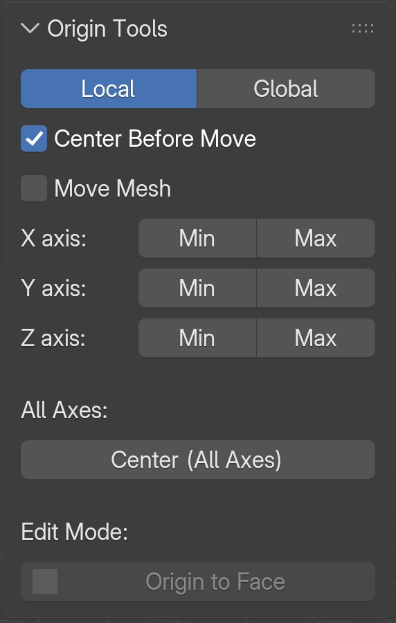
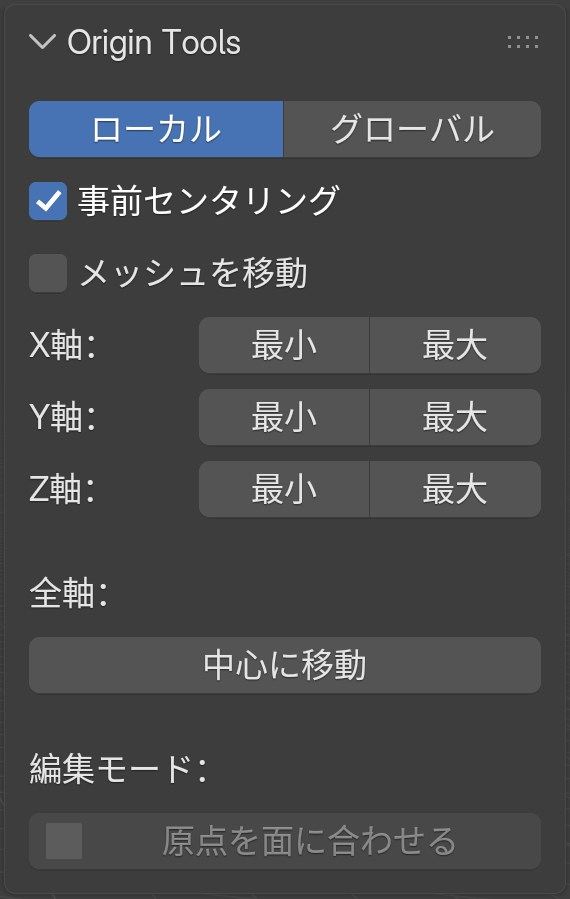

# Origin Tools

**Origin Tools** is a Blender add-on designed to streamline origin adjustment tasks for modeling, scene organization, and workflow efficiency. It allows you to quickly set the origin of objects to the Min, Max, or Center along any axis, or to the center of the bounding box.

## Features

- **Axis-Specific Alignment**: Move object origin to the minimum, maximum, or center along the X, Y, or Z axis.
- **Center Before Move**: Option to center the origin on all axes automatically before moving to a specified Min or Max position.
- **Center All Axes**: Move origin to the center of the bounding box across all axes simultaneously.
- **Origin to Face (Edit Mode)**: Align the object's origin position and rotation to the active face. It automatically rotates the object so the selected face points down towards world -Z.
- **Move Mesh Mode**: Move the mesh data itself instead of the origin to match the specified position. This is useful for maintaining the object's world location.
- **Axis Mode Selection**: Choose between Local and Global (World) coordinate systems for origin operations.
- **Robust Compatibility**: Works accurately regardless of object transform values (location, rotation, scale) and fully supports complex parenting hierarchies.
- **Batch Processing**: Supports executing operations on multiple selected objects at once.

## Installation & Location

1. Install the add-on via `Edit > Preferences > Add-ons > Install...` in Blender.
2. The UI can be found in the `3D Viewport > Sidebar (N-key) > Origin Tools` tab.

## Usage Requirements

- **Blender Version**: Blender 4.0 or newer.
- **Languages**: Includes English (Default) and Japanese translations, automatically switching based on Blender's language settings.

## License

[GPL-3.0-or-later](https://www.gnu.org/licenses/gpl-3.0.html)  
Copyright (C) 2025 Amatsukast

---

# Origin Tools（日本語）

**Origin Tools**は、オブジェクトの原点を各軸（X/Y/Z）の最小・最大・中心、またはバウンディングボックスの中心に素早く移動できるBlenderアドオンです。モデリングやシーン整理の効率化に大きく貢献します。

## 主な機能

- **各軸の原点移動**: オブジェクト原点をX/Y/Z軸のMin、Max、または中心（Center）へ移動させます。
- **事前センタリング**: 指定したMin/Max位置へ原点を移動させる前に、全軸の中心へ自動的に原点をリセットする機能です。
- **全軸の中心へ移動**: バウンディングボックス全軸の中心へ一括で原点を移動させます。
- **面への原点スナップ**: 編集モード専用機能です。アクティブな面（最後に選択した面）に原点を合わせ、面の法線がワールドの下向き（-Z）になるようにオブジェクト全体の回転を自動調整します。
- **メッシュ移動モード**: 原点ではなくメッシュ自体を移動させ、指定位置に合わせるモードです。ワールド座標における原点位置を維持したい場合に極めて有効です。
- **軸モード切替**: ローカル軸とグローバル軸（ワールド座標）を切り替えて操作可能です。
- **堅牢な動作**: トランスフォーム値（位置・回転・スケール）が適用されていなくても問題なく機能し、親子関係や親オブジェクトの変形にも破綻なく対応します。
- **一括処理**: 複数オブジェクトを選択した状態での同時処理に対応しています。

## パネルの場所

`3Dビューポート > サイドバー（Nキー）> Origin Tools`タブ から直感的に操作できるシンプルなUIにアクセスできます。

## 動作条件と言語

- **対応バージョン**: Blender 4.0以降
- **多言語対応**: デフォルトは英語UIですが、Blenderの言語設定が日本語の場合は自動で日本語UIに切り替わります。

## ライセンス

[GPL-3.0-or-later](https://www.gnu.org/licenses/gpl-3.0.html)  
Copyright (C) 2025 Amatsukast
