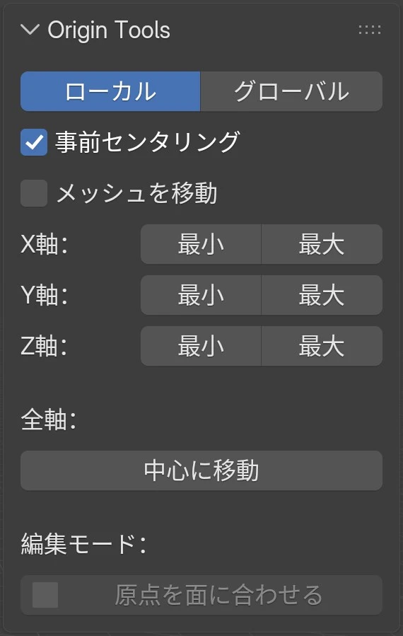
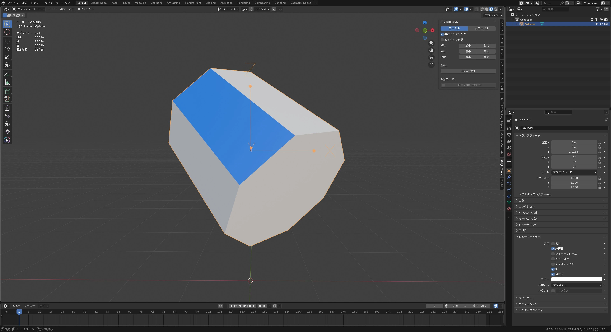
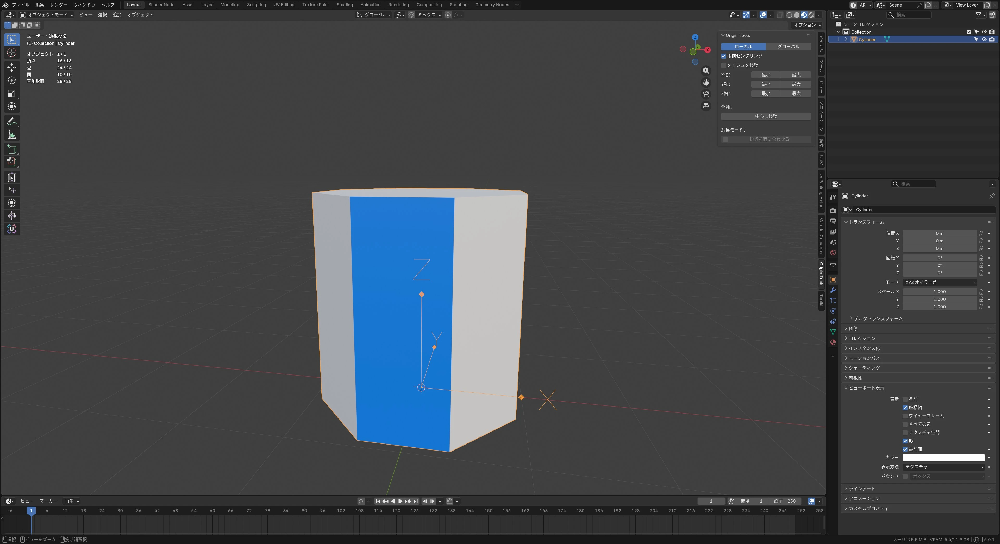

# Origin Tools（原点操作補助ツール）

[English](README.md) | [日本語](README_JP.md)

## 概要

Blenderでのモデリングやシーンレイアウト作業において、オブジェクトの原点位置の調整は避けて通れない工程です。しかし、標準機能だけで特定の端や面に原点を正確に合わせようとすると、3Dカーソルの移動を挟むなど手数がかかり、思考を分断されがちです。

Origin Toolsは、このような原点調整に伴うストレスを払拭し、数クリックで目的の位置へ原点をスナップさせるためのBlenderアドオンです。トランスフォーム値（位置・回転・スケール）や親子関係を持ったオブジェクトでも破綻なく動作し、複数オブジェクトの一括処理にも対応しているため、中〜上級者のワークフロー効率化に大きく貢献します。

## インストール方法

1. GitHubリポジトリの [Releases] から、または `Code > Download ZIP` よりZIPファイルをダウンロードします。
2. Blenderのメニューから `Edit > Preferences` を開きます。
3. `Add-ons` タブを選択し、右上メニュー等から `Install from Disk...`（またはInstall）をクリックしてZIPファイルを選択します。
4. インストールされた `Origin Tools` のチェックボックスをオンにして有効化します。

## パネルの場所

有効化すると、3Dビューポートのサイドバー（Nキー） > `Origin Tools` タブ に専用のUIパネルが追加されます。

## 主な機能

Origin Toolsの機能は、サイドバーのシンプルなUIに集約されています。各機能とオプションの詳細は以下の通りです。

### 基本操作とオプション

| 機能・オプション名     | 詳細                                                                                                                                       |
| ---------------------- | ------------------------------------------------------------------------------------------------------------------------------------------ |
| **X / Y / Z軸移動**    | 指定した軸に沿って、原点をバウンディングボックスの Min（最小値）、Center（中心）、Max（最大値）へ移動します。                              |
| **Center (All Axes)**  | オブジェクトのバウンディングボックス全軸の中心へ一括で原点を移動します。                                                                   |
| **Local / Global切替** | オブジェクト自身のローカル軸、またはワールド座標のグローバル軸のどちらを基準にするかを選択できます。                                       |
| **Move Mesh**          | 原点ではなく、メッシュ自体を移動させて指定位置に合わせるモードです。ワールド座標におけるオブジェクトの原点位置を維持したい場合に有効です。 |
| **Center Before Move** | 各軸のMinまたはMaxへ移動させる際、事前に全軸の中心へ原点をリセットしてから指定位置へ移動するオプションです。                               |

### 編集モード特化機能：Origin to Face

編集モード専用の強力な機能として **Origin to Face** が搭載されています。
メッシュの特定の面を選択してこのボタンを押すと、以下の処理が自動で実行されます。

1. 選択した面の中心へオブジェクトの原点が移動
2. 選択した面の法線がワールドの下向き（-Z方向）になるようにオブジェクト全体が回転

_回転が確定しているオブジェクトの場合：_

- 原点が選択した面の”位置と角度”になります。
- トランスフォームの回転をクリア（`Alt+R`）すると面が真っ直ぐになります。

|                      1. 面の選択                       |                          2. 実行結果（自動回転）                           |                            3. 回転のクリア (`Alt+R`)                             |
| :----------------------------------------------------: | :------------------------------------------------------------------------: | :------------------------------------------------------------------------------: |
|  |                      |                            |
| 任意の面を選択して `Origin to Face` を実行します。  | 原点が面の中心に移動し、面が ワールドの下（-Z）を向くように回転します。 | 回転をクリアすると、選択した面を 基準にしてオブジェクトが真っ直ぐになります。 |

この機能により、傾いた面を地面と平行に直したり、パーツの接合面を基準にしたアセット化が極めて容易になります。

## 実際の活用シーン

Origin Toolsは、以下のような日常的な作業フローで真価を発揮します。

- **アセットの接地設定**
  家具やキャラクターなどを床に正確に配置したい場合、Z軸の Min ボタンを一度押すだけで、原点がオブジェクトの最下端に設定されます。あとはZ座標を0にするだけで完璧に接地します。
- **回転軸・スケール起点の最適化**
  ドアのヒンジ部分や、特定の方向にのみスケールさせたいパーツなど、X軸やY軸のMin/Maxを活用して、意図通りのトランスフォーム起点を瞬時に作成できます。複数オブジェクトを選択して同時に処理できるため、大量のパーツ群の起点整理も一瞬です。
- **キットバッシュ用パーツの規格化**
  モデリングしたディテールパーツをキットバッシュ用のアセットとして保存する際、Origin to Face 機能を使って貼り付け面を底面（-Z方向）に向けておくことで、スナップ機能を用いた配置が劇的にスムーズになります。

## 動作条件と言語

- **対応バージョン**: Blender 4.2以降
- **多言語対応**: デフォルトは英語UIですが、Blenderの言語設定が日本語の場合は自動で日本語UIに切り替わります。

## ライセンス

[GPL-3.0-or-later](https://www.gnu.org/licenses/gpl-3.0.html)  
Copyright (C) 2025 Amatsukast
